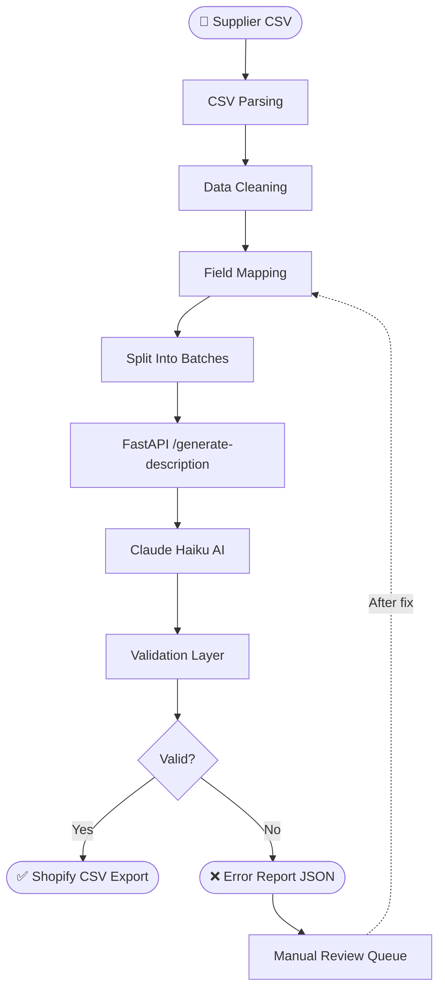

# Workflow Overview — Shopify Bulk Product Importer

> AI-powered pipeline for importing Turkish supplier CSV data, generating SEO descriptions with Claude AI, and exporting Shopify-ready product files.

---

## Pipeline Flowchart



---

## Step-by-Step Explanation

### Step 1 — Supplier CSV

The pipeline begins with a raw CSV file exported from the supplier's ERP or inventory system. These files are intentionally messy: product names may be lowercase or contain abbreviations, prices might be missing, SKUs can appear duplicated across catalog updates, and color/category fields often deviate from the approved value lists.

**Input file:** `supplier_sample.csv`  
**Columns:** `Stok Kodu`, `Ürün Adı`, `Kategori`, `Marka`, `Fiyat`, `Stok`, `Renk`, `Boyut`, `Malzeme`, `Açıklama`

---

### Step 2 — CSV Parsing

An n8n workflow node reads the incoming CSV file and converts each row into a structured JSON object. The parser enforces UTF-8 encoding to handle Turkish characters (ş, ğ, ü, ö, ı, ç) correctly, and trims leading/trailing whitespace from all field values.

**Technology:** n8n CSV Parse node  
**Output:** Array of raw product objects (one per supplier row)

---

### Step 3 — Data Cleaning

This is the most critical pre-processing stage. A Python data-cleaning module applies the following rules to every product record:

| Rule | Example |
|------|---------|
| Title-case product names | `pamuklu yatak örtüsü` → `Pamuklu Yatak Örtüsü` |
| Expand abbreviations | `nevresim tkm` → `Nevresim Takımı` |
| Fuzzy-match color values | `beya` → `beyaz` (96% confidence) |
| Normalize category names | `MUTFAK` → `Mutfak` |
| Standardize size formats | `200x220` → `200x220 cm` |
| Flag missing required fields | Empty `Fiyat` → ERR-002 |
| Reject invalid numeric values | `Fiyat = -1` → ERR-004 (critical) |
| Detect duplicate SKUs | Second `TXT001` → ERR-001 (skipped) |
| Normalize missing brand | Empty `Marka` → `Genel` (fallback) |

Errors and warnings are accumulated into an in-memory error list and flushed to `error_report.json` at the end of the pipeline run.

---

### Step 4 — Field Mapping

Cleaned supplier fields are mapped to Shopify's product schema. This includes generating a URL-safe `Handle` from the product title and building the `Tags` string from the category, color, material, and brand fields.

| Supplier Field | Shopify Field |
|----------------|---------------|
| `Stok Kodu` | `Variant SKU` |
| `Ürün Adı` (cleaned) | `Title` |
| `Marka` | `Vendor` |
| `Kategori` (mapped) | `Product Category` |
| `Fiyat` | `Variant Price` |
| `Stok` | `Variant Inventory Qty` |
| `Renk` | `Option1 Value` |
| *(generated)* | `Handle` |
| *(generated via AI)* | `Body (HTML)` |

---

### Step 5 — Split Into Batches

To stay within the Claude API's rate limits and allow parallel processing, the cleaned product list is divided into batches of 10 products each. Each batch is dispatched concurrently to the FastAPI service via n8n's HTTP Request node with retry logic (up to 3 retries with exponential backoff on 429/503 responses).

**Batch size:** 10 products  
**Concurrency:** Up to 3 simultaneous batches  
**Retry policy:** 3 retries, exponential backoff (2s → 4s → 8s)

---

### Step 6 — FastAPI `/generate-description`

The FastAPI service acts as the orchestrator between n8n and the Claude API. It receives a single product record per request, validates the input schema with Pydantic, constructs a structured prompt in Turkish, and forwards it to Claude.

**Endpoint:** `POST /generate-description`  
**Input schema:** `ProductDescriptionRequest` (Pydantic model)  
**Response schema:** `ProductDescriptionResponse`  
**Timeout:** 30 seconds per request  
**Authentication:** `X-API-Key` header

---

### Step 7 — Claude Haiku AI

Claude Haiku generates a professional, SEO-optimized Turkish product description for each item. The prompt includes the product's cleaned name, category, material, size, color, and brand, instructing the model to produce an HTML-formatted description with:

- A short introductory sentence highlighting the product's key benefit
- A bulleted list of technical specifications
- A closing paragraph describing suitable usage scenarios
- A final SEO keyword line embedded naturally in the text

**Model:** `claude-haiku-4-5-20251001`  
**Prompt language:** Turkish  
**Output format:** HTML  
**Average tokens:** ~800 input / ~500 output per product

---

### Step 8 — Validation Layer

Before the description is accepted, a validation module checks the Claude output against a quality rubric:

- Minimum description length (≥ 200 characters)
- Valid HTML structure (no unclosed tags)
- Brand name present in the text
- Material and size mentioned at least once
- Color mentioned at least once
- No placeholder or lorem ipsum text

Products that fail validation are routed to the error report and excluded from the final CSV. Products that pass proceed to the export step.

---

### Step 9 — Shopify CSV Export

All validated products are written to a Shopify-compatible CSV file. The column order and header names match Shopify's bulk import template exactly, ensuring zero friction during the store import process.

**Output file:** `shopify_output_sample.csv`  
**Shopify feature compatibility:** Products > Import (Admin panel)  
**Status:** All exported products set to `active`

---

### Step 10 — Error Report

A structured JSON report is generated at the end of each pipeline run, documenting every error and warning encountered during processing. Each entry includes the SKU, row number, original value, severity level, and a human-readable suggested fix.

**Output file:** `error_report.json`  
**Severity levels:** `critical` → `error` → `warning`  
**Auto-resolved entries:** Warnings that were auto-corrected (e.g., typos) are flagged with `"auto_resolved": true` and include the applied resolution.

---

## Technology Stack

| Component | Technology |
|-----------|------------|
| Workflow Automation | n8n (self-hosted) |
| API Service | Python 3.11 + FastAPI |
| AI Description Engine | Anthropic Claude Haiku |
| Data Validation | Pydantic v2 |
| CSV Processing | pandas |
| Containerization | Docker + Docker Compose |
| Output Format | Shopify CSV Import |

---

## Environment Variables

```env
ANTHROPIC_API_KEY=sk-ant-...
FASTAPI_PORT=8000
BATCH_SIZE=10
MAX_CONCURRENT_BATCHES=3
RETRY_ATTEMPTS=3
LOG_LEVEL=INFO
```
